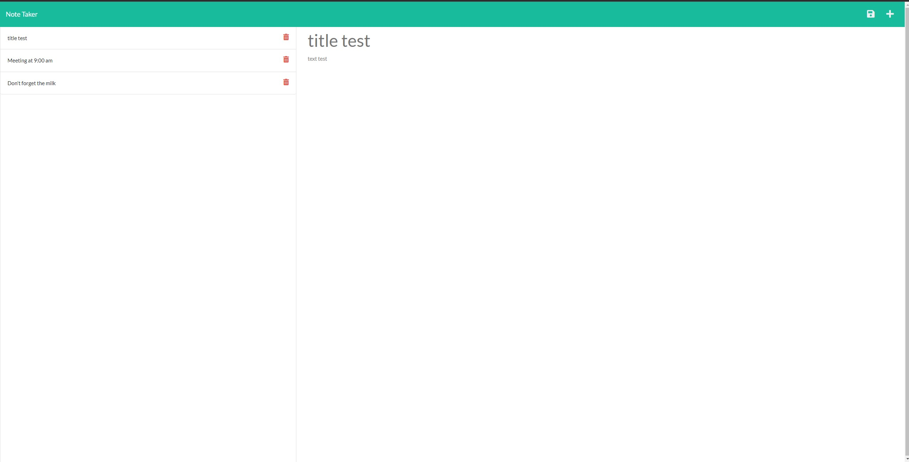

# Note-saver

## Purpose 
This webpage can be used by users to write, save, and delete notes 

## Outline 
* the landing page explains the functionality of the site, saying it can "take notes with express" and includeds a button which redirects to the note page
* on the note page, prior saved notes are shown on the left, with the right is used to enter new notes.
* Saved notes can be pulled up again by clicking on them, or deleted by clicking on the trash icon next to their title

## Built with
* express.js
* Javascript

## Screenshot

## Website

## Contributor
* j-maclellan